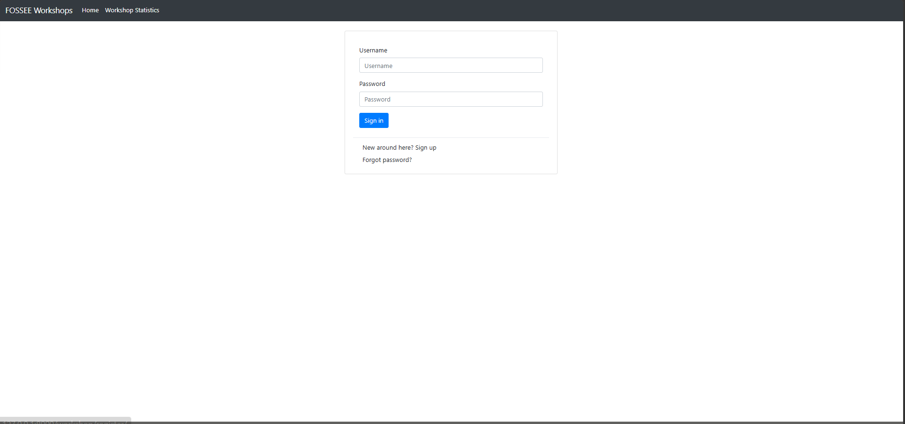
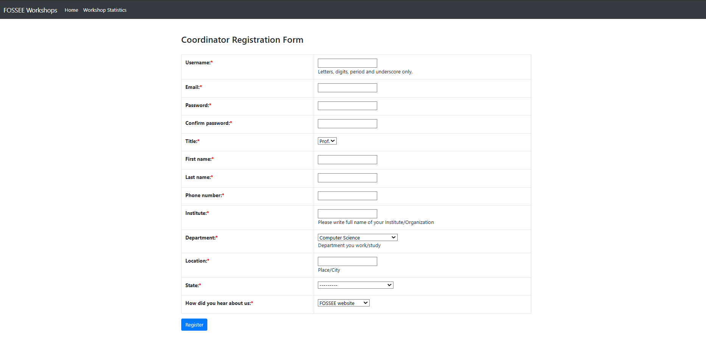
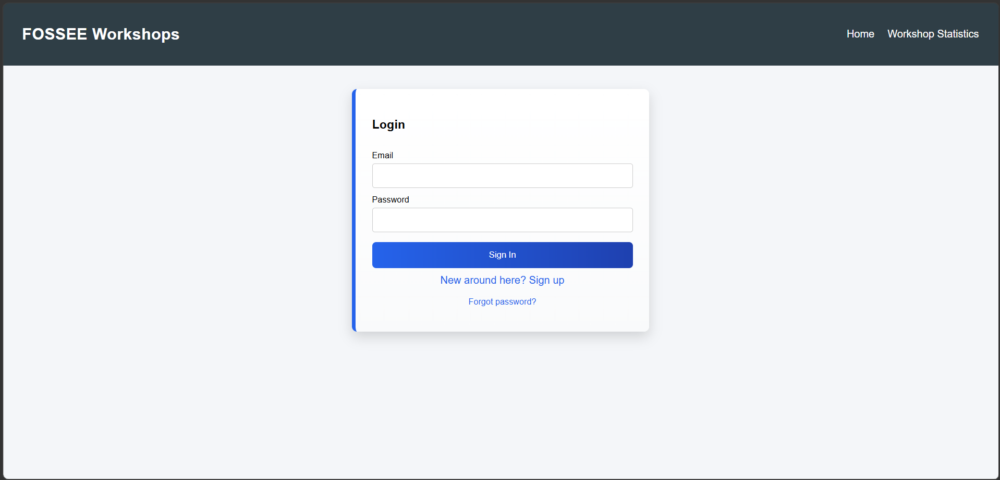
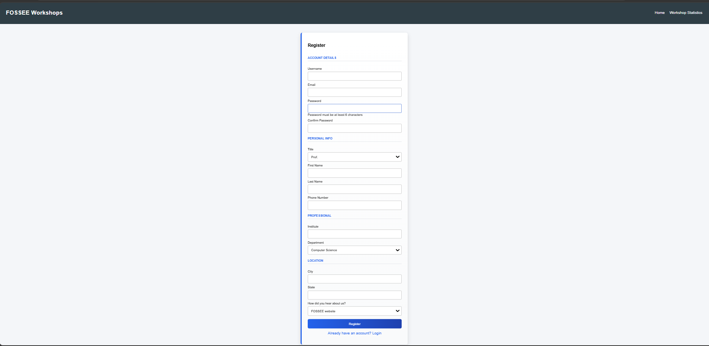

# FOSSEE UI/UX Enhancement

## Overview

This project enhances the UI/UX of the FOSSEE Workshop Booking platform while preserving the original structure and workflow.

The focus was on improving usability, readability, responsiveness, and overall user experience, with special attention to mobile accessibility.

---

## Improvements Made

* Improved layout and spacing for better readability
* Structured form into logical sections (Account, Personal, Professional, Location)
* Enhanced visual hierarchy using headings and alignment
* Added validation for password confirmation
* Provided user feedback messages (success/error states)
* Improved input focus and hover interactions
* Added subtle UI enhancements (accent border, smooth transitions, button effects)
* Made the interface responsive for mobile devices

---

## Design Principles

* **Clarity** → Simplified layout for easy understanding
* **Consistency** → Uniform spacing and styling across components
* **Minimalism** → Clean design without unnecessary complexity
* **Feedback** → Immediate response to user actions
* **Accessibility** → Improved interaction states and readability

---

## Responsiveness

The interface adapts across devices using responsive CSS.

For mobile:

* Reduced layout width
* Improved touch-friendly spacing
* Simplified navigation and structure

---

## Trade-offs

* Avoided heavy animations to maintain performance
* Focused on usability over visual complexity
* Did not use external libraries to keep implementation lightweight and clean

---

## Challenges

Balancing UI improvements while keeping the original structure intact was a key challenge.

This was addressed by enhancing layout, spacing, and interaction patterns instead of redesigning the entire system.

---

## Setup Instructions

```bash
npm install
npm start
```

---

## Screenshots

### Original UI

#### Login Page



#### Registration Page



---

### Improved UI

#### Login Page



#### Registration Page



---

## Conclusion

The redesigned interface improves usability, clarity, and responsiveness while maintaining the original system functionality.

---

## Author

Kapil Ramnani
